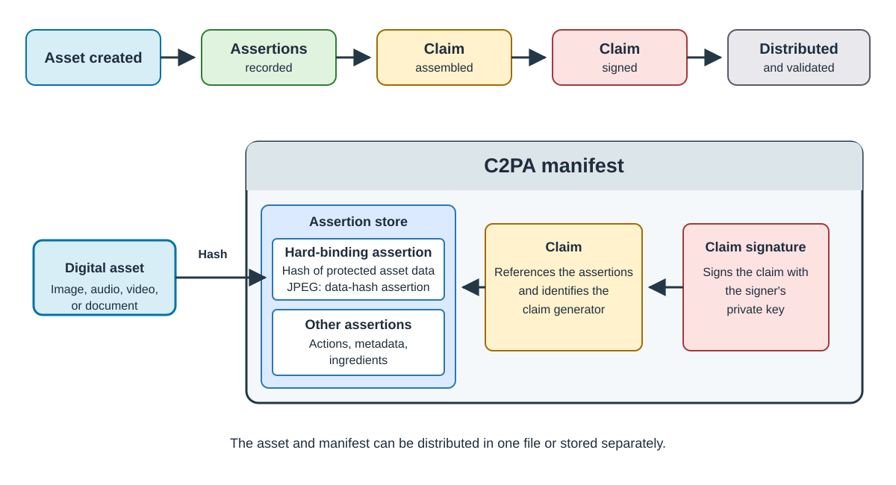

## Synthetic and untraceable media

Advances in cameras, editing software, and generative AI make digital content easy to create and
modify. Synthetic or manipulated images, video, and audio can be difficult to distinguish from
captured media by appearance alone.

This ambiguity creates opportunities for misinformation, impersonation, and fraud. It also affects
legitimate content. When origin and edit history are missing, you cannot reliably trace where a file
came from, which tools changed it, or whether it is being presented in its original context.

The problem is not the existence of synthetic media. The problem is the loss of reliable context as
media moves between people, tools, and services. Media needs provenance information that remains
associated with the asset and can be checked for tampering.

## EU AI Act transparency requirements

[Article 50 of the EU AI Act](https://digital-strategy.ec.europa.eu/en/policies/guidelines-ai-transparency-obligations)
has applied since 2 August 2026. It requires providers of AI systems in scope to mark synthetic audio,
image, video, and text outputs in a machine-readable format so that they can be detected as
AI-generated or manipulated.

Separate disclosure rules apply to people and organizations that deploy AI systems. Deepfakes must
be clearly disclosed to the people who encounter them. Certain AI-generated or manipulated text
published to inform the public on matters of public interest must also be disclosed. The Act includes
scope conditions and exceptions, so machine-readable provenance is one part of meeting these
transparency obligations rather than a complete legal solution.

## C2PA Content Credentials

The [Coalition for Content Provenance and Authenticity (C2PA)](https://c2pa.org/) defines an open technical standard for
recording provenance information, such as how an asset was created and modified, and binding that
information to digital content. The same model can be used across supported media types and
platforms.

A *Content Credential* is the preferred non-technical term for a [C2PA manifest](https://spec.c2pa.org/specifications/specifications/2.4/specs/C2PA_Specification.html#_c2pa_manifest). The manifest packages
statements about an asset's origin, the tools used to process it, and the actions performed during its
history. The manifest can travel with the asset or remain available separately.

A verifier can inspect these statements, verify the signature on the claim, and check the
cryptographic binding between the manifest and the asset.

This gives the recipient a tamper-evident record of the asset's claimed origin and history. Content
Credentials do not detect fake media or determine whether a claim is true. C2PA can provide the
digitally signed metadata layer described in the
[Article 50 Code of Practice](https://digital-strategy.ec.europa.eu/en/policies/code-practice-ai-generated-content).
For images, signatories following the Code generally combine that layer with imperceptible
watermarking and a detection solution that meets effectiveness, reliability, robustness, and
interoperability requirements. This Learning Path demonstrates only C2PA metadata, so it does not
establish compliance on its own.

## Understand the C2PA workflow

A C2PA workflow connects a digital asset to a signed provenance record. A claim generator records
statements about the asset as [*assertions*](https://spec.c2pa.org/specifications/specifications/2.4/specs/C2PA_Specification.html#_assertions). These assertions can describe how the asset was created,
the actions applied to it, and the information used to bind the manifest to the asset.

The [claim](https://spec.c2pa.org/specifications/specifications/2.4/specs/C2PA_Specification.html#_claims) references the assertions and identifies the claim generator. A [claim signature](https://spec.c2pa.org/specifications/specifications/2.4/specs/C2PA_Specification.html#claim-signature-definition) signs the
claim with the signer's private key. The assertions, claim, and claim signature form the C2PA
manifest.

The [hard binding](https://spec.c2pa.org/specifications/specifications/2.4/specs/C2PA_Specification.html#_hard_bindings)
is itself recorded in an assertion. For the JPEG example, a data-hash assertion records a hash of
protected asset data. The claim references that assertion, so the claim signature also protects the
recorded binding.

The asset and manifest can travel in the same file or remain separate. A validator locates the
manifest, checks its structure and signature, verifies the binding to the asset, and evaluates the
signing credential against its trust policy.

This diagram summarizes the model defined by the
[C2PA technical specification](https://spec.c2pa.org/specifications/specifications/2.4/specs/C2PA_Specification.html).

## Understand trust in Content Credentials

The [C2PA trust model](https://spec.c2pa.org/specifications/specifications/2.4/specs/C2PA_Specification.html#_trust_model) distinguishes a *valid manifest* from a *trusted manifest*. A valid manifest is well-formed, has
not changed since it was signed, and passes the required signature, validity-period, and credential
revocation checks. A trusted manifest is valid and its signing credential is also trusted. A validator
can establish credential trust through configured trust anchors, including anchors from the
[C2PA Trust List](https://spec.c2pa.org/specifications/specifications/2.4/specs/C2PA_Specification.html#_c2pa_trust_list), or through a credential that the user has explicitly added to a private credential store.

Trust applies to the signing credential and the signer identity associated with it. It does not prove
that every assertion is factually true. The consumer uses the signer identity, the assertions, and
other trust signals to decide whether to rely on the provenance record.

## Preview the result

<!-- DRAFT PLACEHOLDER: Review whether this duplicates the Learning Path overview. -->

TODO: Preview the four observable results without introducing commands:

- The unsigned source image has no C2PA manifest.
- The signed image contains a manifest bound to the image.
- The manifest report separates successful signature and asset-binding checks from the untrusted
  development credential.
- The controlled-change asset retains its manifest but fails the intended hard-binding check.

Use the final tested fixtures and short output excerpts from the hands-on pages. Do not imply that the
untrusted credential caused signing to fail, or that the failed hard binding proves every possible
change to an asset can be detected.

## Read validation results in layers

<!-- DRAFT PLACEHOLDER: Consider moving this framework to the inspection and validation page. -->

TODO: Give the learner a four-question framework for reading the validation report:

1. **Manifest validity:** Is the manifest well-formed, unchanged, and signed with a credential that
   passes the required validity-period and revocation checks?
2. **Asset binding:** Does the protected image data match the hash recorded by the manifest?
3. **Credential trust:** Does the validator trust the signing credential through an accepted trust
   anchor or an explicitly trusted private credential?
4. **Assertion meaning:** What does the signer claim about the asset, and does the consumer have a
   reason to rely on that claim?

Explain that these answers are independent. A valid signature and matching asset binding do not make
the signing credential trusted. A trusted credential does not make every assertion factually true.
The workflow also does not demonstrate hardware-backed key custody or platform attestation.

## What you've learned and what's next

TODO: Recap the problem, the role of Content Credentials, and the distinction between validity,
credential trust, and truth. Then direct the learner to confirm that C2PA Tool is available and
prepare the example files.
